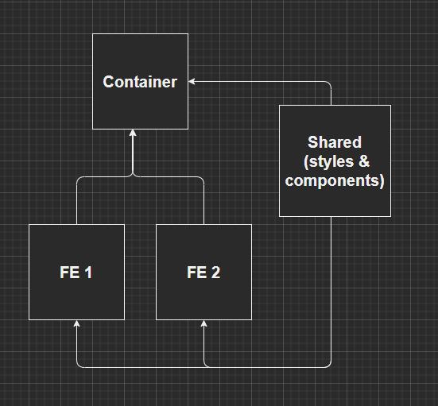

# Barebones Mirco Front End

This project is a mono-repo example of a micro front ends (MFEs), with minimal amount of configuration per project.

##

There are 4 projects in this repository:

- Container - glues everything together, consumes the other apps
- FE 1 - a minimal app using the `FruitButton` from the Shared app
- FE 2 - a minimal app using the `VegetableButton` from the Shared app
- Shared - an app (library, really) that shares its styles & components in real time to all other apps.

(Note: All projects here are React based)

## To Run in Development Mode

1. From the root directory run `npm install`. The shared workspaces from the `package.json` at this level make it possible to download all child package dependencies. (A.K.A you don't need to do an npm install at each level)

2. Each project will run an app with its own localhost port (specified from each `webpack.dev.js`) so you'll need to run each project on its own to see all the pieces put together. Run each of these in a seperate terminal windows:
   - From the root, navigate to shared project `cd .\shared\`
     - Run `npm start`
   - From the root, navigate to FE 1 project `cd .\front-ends\react-front-end-1\`
     - Run `npm start`
   - From the root, navigate to FE 2 project `cd .\front-ends\react-front-end-2\`
     - Run `npm start`
   - From the root, navigate to the container project `cd .\container\`
     - Run `npm start`

After the container finishes starting up you you be able to access the `localhost:8080` from your browser to see everything put together
